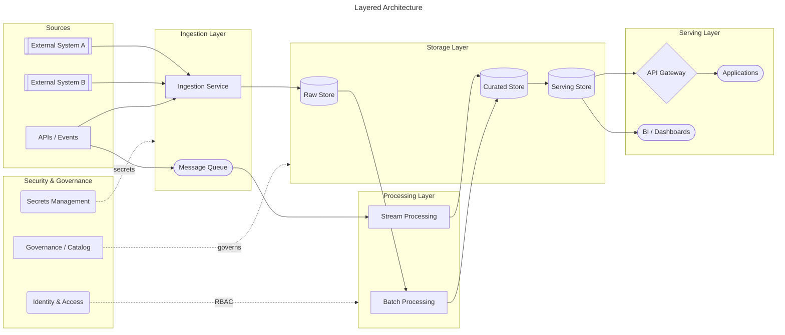
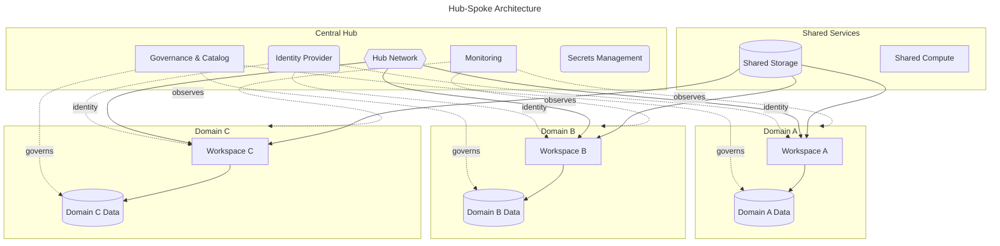
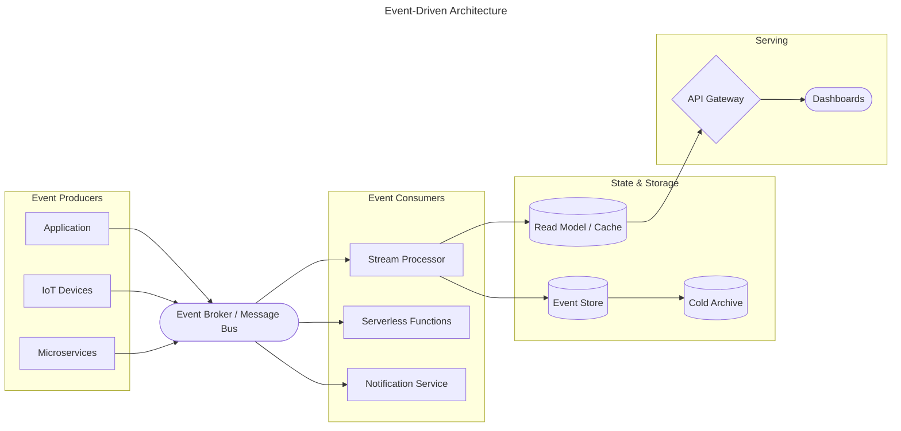
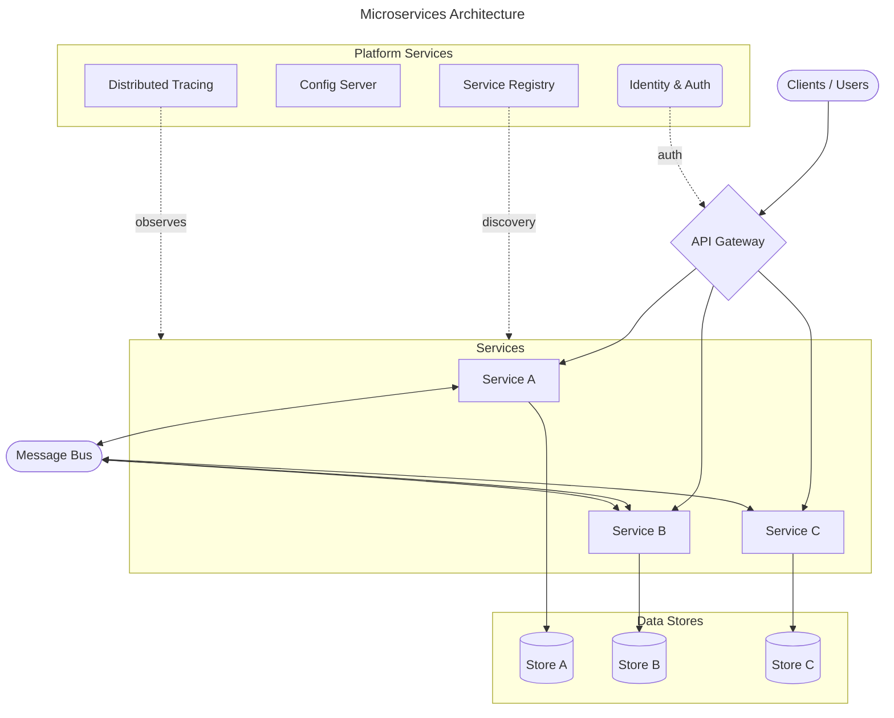
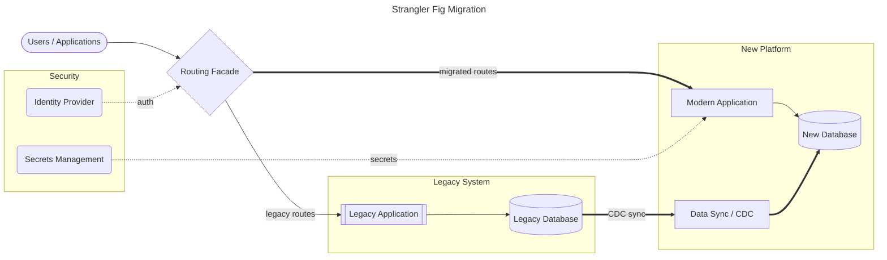
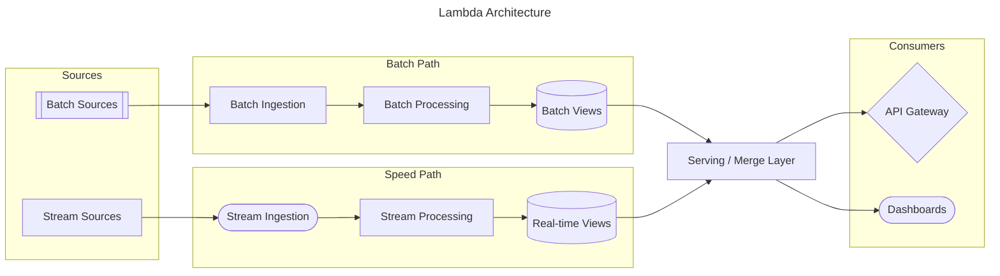

# Generic Architecture Patterns

Domain-agnostic architecture patterns for use as starting points in ADS sessions. Overlay domain-specific components from the loaded domain skill (Databricks, Fabric, AWS, etc.) onto these base patterns.

## Pattern Selection Guide

```
START
├── What is the primary architectural concern?
│   ├── Data flows through layers of processing
│   │   └── Pattern 1: Layered / N-Tier
│   ├── Multiple independent teams / domains
│   │   └── Pattern 2: Hub-Spoke (or Data Mesh overlay)
│   ├── Real-time event processing
│   │   └── Pattern 3: Event-Driven
│   ├── Independent deployable services
│   │   └── Pattern 4: Microservices
│   ├── Migration from legacy systems
│   │   └── Pattern 5: Strangler Fig
│   └── Mixed workloads (batch + streaming + serving)
│       └── Pattern 6: Lambda / Kappa
│
├── Is there a centralized governance requirement?
│   ├── YES → Add hub-spoke governance overlay
│   └── NO → Flat structure
│
└── Multi-region or HA requirements?
    ├── YES → Add active-passive or active-active pattern
    └── NO → Single-region design
```

---

## Pattern 1: Layered / N-Tier

**Use when**: Clear separation of concerns — ingestion, processing, storage, serving. Most common pattern for data platforms and web applications.



---

## Pattern 2: Hub-Spoke

**Use when**: Central governance team with multiple domain teams. Shared infrastructure (networking, identity, monitoring) in the hub; domain-specific workloads in spokes.



---

## Pattern 3: Event-Driven

**Use when**: Real-time processing, loose coupling between producers and consumers, event sourcing, CQRS.



---

## Pattern 4: Microservices

**Use when**: Independent deployable services, polyglot persistence, team autonomy, CI/CD per service.



---

## Pattern 5: Strangler Fig (Migration)

**Use when**: Incremental migration from legacy to modern platform. Route traffic through a facade that progressively shifts to the new system.



---

## Pattern 6: Lambda / Kappa (Batch + Streaming)

**Use when**: Need both batch and real-time processing paths. Lambda has separate paths; Kappa unifies through streaming.

### Lambda Variant (Dual Path)



---

## Combining Patterns

These patterns are composable. Common combinations:

| Combination | When to Use |
|-------------|-------------|
| Layered + Hub-Spoke | Multi-team data platform with centralized governance |
| Event-Driven + Microservices | Distributed application with real-time event processing |
| Strangler Fig + Layered | Migration to a modern layered architecture |
| Lambda + Hub-Spoke | Multi-domain platform with batch + streaming needs |

When combining, start with the primary pattern and overlay components from secondary patterns. The domain skill provides the specific technology components to fill in each layer.
