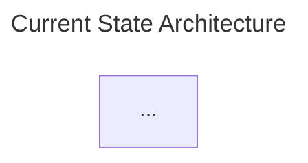

# Mermaid Style Guide

Consistent conventions for architecture diagrams generated during ADS sessions. These rules apply to both Current State and Future State diagrams.

## Layout Direction

| Scenario | Direction | Rationale |
|----------|-----------|-----------|
| Most architectures (data flows left-to-right) | `flowchart LR` | Natural reading order for pipelines and data flows |
| Hierarchical / governance-heavy (mesh, ML platforms) | `flowchart TB` | Emphasizes top-down governance and ownership |
| Small diagrams (< 6 nodes) | Either | Use whichever reads more clearly |

## Node Shapes by Component Type

Use consistent shapes so the reader can identify component types at a glance:

| Component Type | Shape | Mermaid Syntax | Example |
|----------------|-------|----------------|---------|
| **Compute / Processing** | Rectangle | `[Name]` | `[Kubernetes Cluster]` |
| **Storage / Database** | Cylinder | `[(Name)]` | `[(PostgreSQL)]` |
| **Security / Identity** | Rounded rectangle | `(Name)` | `(Key Vault)` |
| **Networking** | Hexagon or Stadium | `{{Name}}` or `([Name])` | `{{Hub VNet}}`, `([Load Balancer])` |
| **External Systems** | Double-bordered rectangle | `[[Name]]` | `[[On-Prem ERP]]` |
| **User / Consumer** | Stadium | `([Name])` | `([End Users])` |
| **Decision / Gateway** | Diamond | `{Name}` | `{API Gateway}` |

### Cloud Provider-Specific Guidance

When using a domain skill (Databricks, AWS, GCP, etc.), defer to that skill's component-shape mappings if they exist. The above table is the fallback for components not covered by the domain skill.

## Arrow Styles

| Arrow | Meaning | Example |
|-------|---------|---------|
| `-->` | Data flow / primary path | `Source --> Ingestion --> Storage` |
| `-.->` | Governance / security / policy | `IAM -.->&#124;RBAC&#124; Storage` |
| `==>` | Migration path / emphasis | `Legacy ==> New Platform` |
| `--x` | Blocked / deprecated flow | `OldAPI --x NewGateway` |

### Edge Labels

Always add labels when the relationship is not obvious:

```mermaid
A -->|batch ETL| B
C -.->|governs| D
E ==>|phase 1 migration| F
```

## Subgraph Conventions

- **Always name subgraphs** with quoted labels:
  ```
  subgraph SEC["Security & Identity"]
  ```
- **Group by logical boundary**, not by product:
  - Good: `subgraph INGESTION["Ingestion Layer"]`
  - Bad: `subgraph ADF["Azure Data Factory"]`
- **Nest sparingly** — max 2 levels deep. Deeply nested subgraphs become unreadable.
- **Indentation**: 2 spaces within subgraphs.

## Naming Conventions

- **Node IDs**: Short uppercase identifiers — `SQLWH`, `KV`, `ENTRA`, `LFC`
- **Display labels**: Human-readable — `[SQL Warehouse]`, `(Azure Key Vault)`
- **Subgraph IDs**: Short uppercase — `SEC`, `SRC`, `DBX`, `CONSUME`
- **Subgraph labels**: Descriptive in quotes — `"Security & Identity"`, `"Data Sources"`

## Diagram Title

Use the Mermaid front matter to add a title:



For the dual-diagram ADS workflow, always use:
- `title: Current State Architecture` for the Phase 2 diagram
- `title: Future State Architecture` for the Phase 5 diagram

## Completeness Rules

1. **Every component discussed in the session** should appear in the diagram. Do not omit security, monitoring, or governance components.
2. **Show the security boundary** — if private networking was discussed, show VNets, firewalls, and private endpoints.
3. **Include governance flows** — use dashed arrows (`-.->`) for governance/policy relationships.
4. **Annotate pain points** in Current State diagrams using Mermaid comments (`%% Pain point: ...`) or styled nodes.
5. **Keep it scannable** — if the diagram exceeds ~20 nodes, consider splitting into a high-level overview and detailed sub-diagrams.

## Color and Styling (Optional)

If the rendering target supports Mermaid themes, use `classDef` for visual emphasis:

```mermaid
classDef highlight fill:#f9f,stroke:#333,stroke-width:2px
classDef deprecated fill:#ddd,stroke:#999,stroke-dasharray: 5 5

A[New Service]:::highlight
B[Legacy Service]:::deprecated
```

Use sparingly — clarity beats aesthetics.
