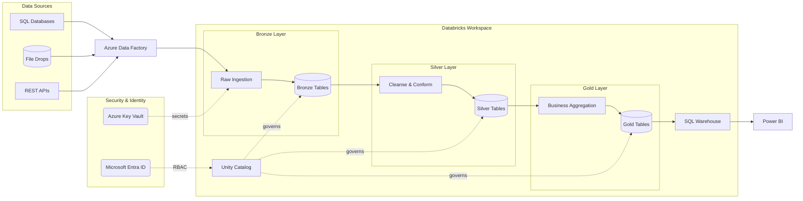
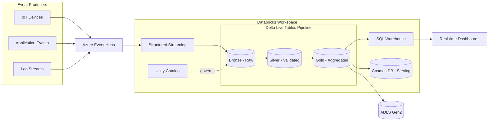
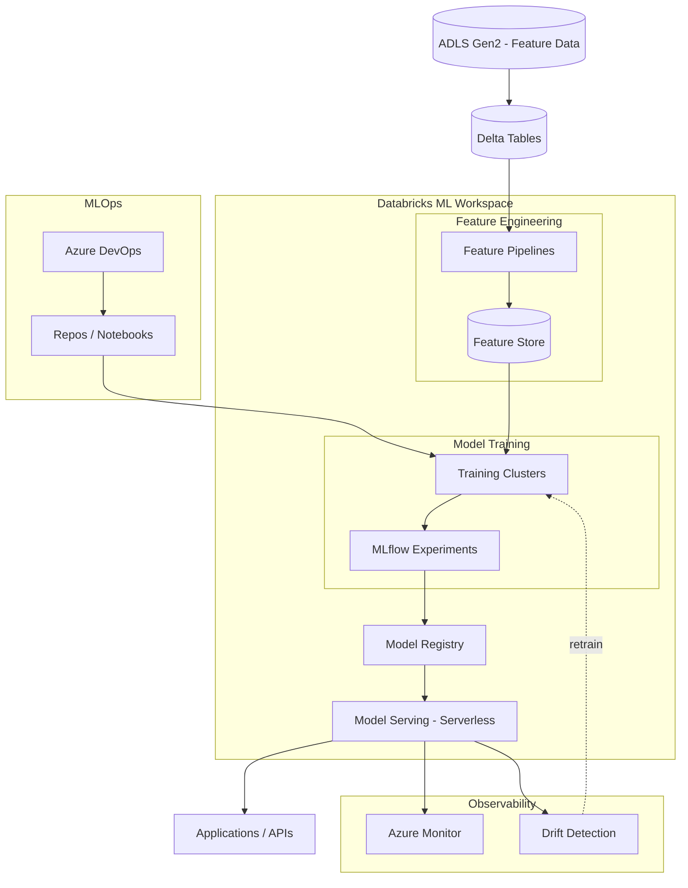
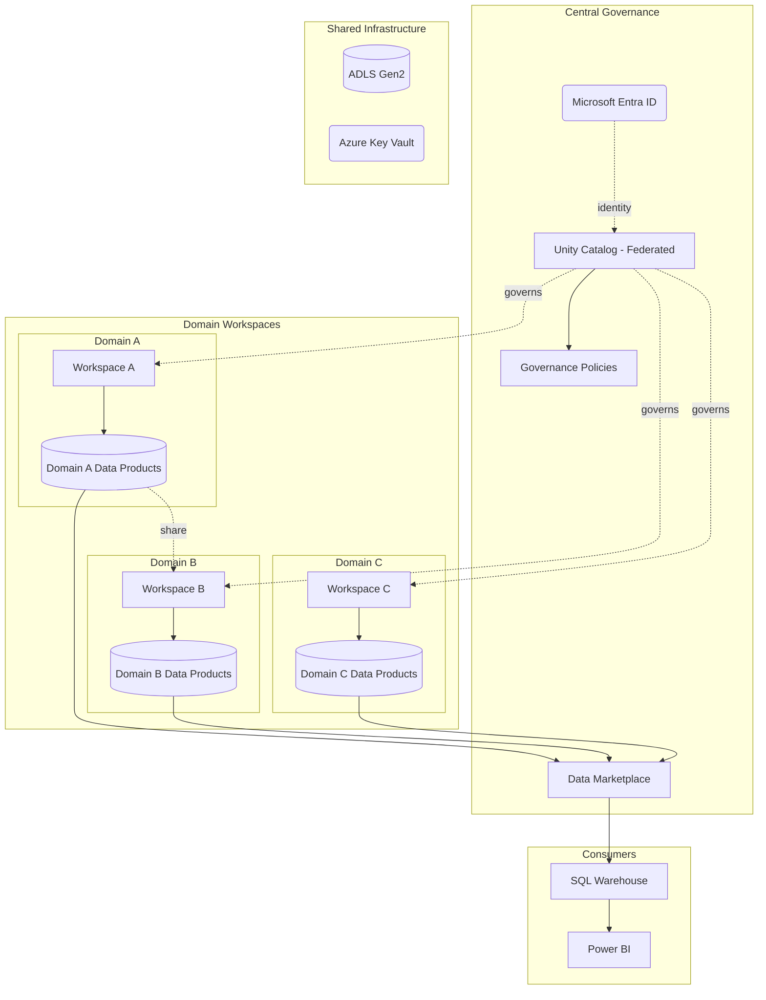
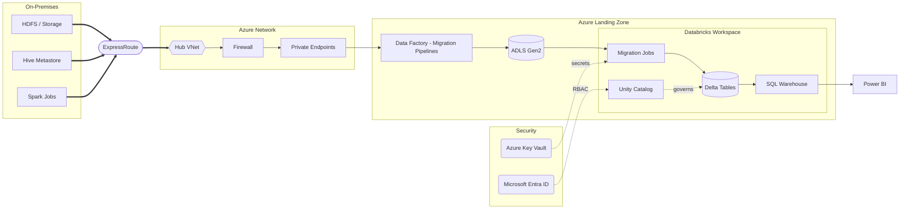
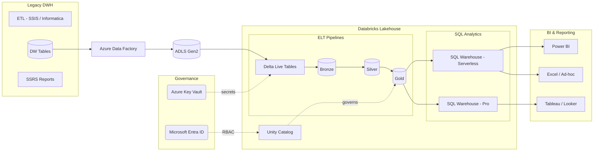
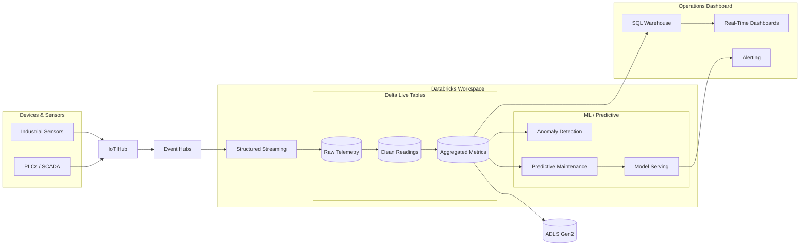
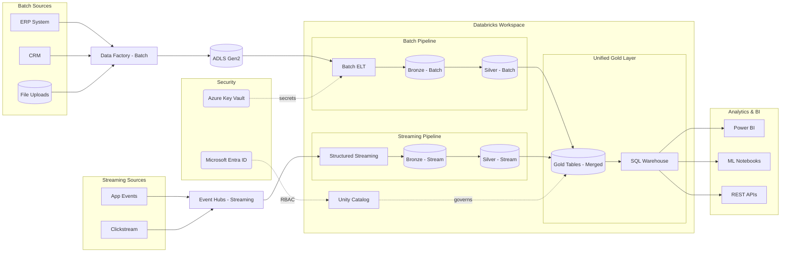

# Databricks Architecture Patterns

## Pattern Selection Decision Tree

```
START
├── Is this a migration from an existing platform?
│   ├── YES → Which source platform?
│   │   ├── Hadoop/Hive → Pattern 5: On-Prem Migration
│   │   ├── Snowflake/Redshift/Synapse → Pattern 6: Data Warehouse Replacement
│   │   ├── AWS EMR/Glue → Pattern 5 (cloud-to-cloud variant)
│   │   └── On-prem SQL Server/Oracle → Pattern 5 (database migration variant)
│   └── NO → Greenfield. What's the primary workload?
│       ├── General analytics / data warehouse → Pattern 1: Medallion Lakehouse
│       ├── Real-time / streaming → Pattern 2: Streaming Lakehouse
│       ├── ML/AI focus → Pattern 3: ML Platform
│       ├── Multi-team / data mesh → Pattern 4: Data Mesh
│       ├── IoT / telemetry → Pattern 7: IoT Analytics
│       └── Mixed batch + streaming → Pattern 8: Hybrid
│
├── Are there real-time requirements?
│   ├── YES → Combine chosen pattern with Pattern 2 (Streaming) components
│   └── NO → Batch-only design
│
├── Are there ML/AI workloads?
│   ├── YES → Add Pattern 3 (ML) components to chosen pattern
│   └── NO → Skip ML infrastructure
│
└── Multiple teams with domain ownership?
    ├── YES → Overlay Pattern 4 (Data Mesh) workspace structure
    └── NO → Single workspace per environment
```

---

## Pattern 1: Medallion Lakehouse

**Use when**: General analytics, data warehouse modernization, single-team data platform, first Databricks deployment.

**Azure Components**: ADLS Gen2, ADF, Databricks (Jobs + SQL Warehouse), Unity Catalog, Key Vault, Monitor, Entra ID

**Architecture**:
```
Sources → ADF (Ingest) → ADLS Gen2 (Bronze) → Databricks Jobs (Transform)
→ ADLS Gen2 (Silver) → Databricks Jobs (Curate) → ADLS Gen2 (Gold)
→ SQL Warehouse (Serve) → Power BI / Tableau
Unity Catalog governs all layers. Key Vault stores secrets. Monitor observes.
```

**Diagram Code**:


---

## Pattern 2: Streaming Lakehouse

**Use when**: Real-time analytics, sub-minute latency requirements, click-stream, event processing, CDC pipelines.

**Azure Components**: Event Hubs (or IoT Hub), ADLS Gen2, Databricks (Structured Streaming + DLT), SQL Warehouse, Key Vault

**Architecture**:
```
Event Producers → Event Hubs → Databricks Structured Streaming → Delta Live Tables
→ Bronze/Silver/Gold in ADLS Gen2 → SQL Warehouse → Real-time Dashboards
```

**Diagram Code**:


---

## Pattern 3: ML Platform

**Use when**: Machine learning is the primary workload, need MLOps pipeline, model serving, feature engineering.

**Azure Components**: ADLS Gen2, Databricks (ML Runtime + Feature Store + MLflow), Model Serving, AKS (optional for custom serving), Key Vault

**Architecture**:
```
Feature Data → Databricks Feature Store → Training Clusters (GPU optional)
→ MLflow Experiment Tracking → Model Registry → Model Serving Endpoints
→ Applications / Real-time Predictions
```

**Diagram Code**:


---

## Pattern 4: Data Mesh

**Use when**: Multiple teams with domain ownership, organizational decentralization, self-service analytics with governance.

**Azure Components**: Multiple Databricks Workspaces, Unity Catalog (metastore federation), ADLS Gen2 per domain, Entra ID, Azure Policy

**Architecture**:
```
Central Governance (Unity Catalog Metastore + Entra ID)
├── Domain A Workspace → Domain A Storage → Domain A Products
├── Domain B Workspace → Domain B Storage → Domain B Products
└── Domain C Workspace → Domain C Storage → Domain C Products
Cross-domain sharing via Unity Catalog data sharing
```

**Diagram Code**:


---

## Pattern 5: On-Prem Migration

**Use when**: Migrating from Hadoop, Teradata, Oracle, or on-prem SQL Server. Requires hybrid connectivity.

**Azure Components**: ExpressRoute/VPN Gateway, VNet, ADLS Gen2, ADF (for data movement), Databricks (VNet-injected), Private Endpoints

**Architecture**:
```
On-Prem Systems → ExpressRoute/VPN → Azure VNet → ADF (Copy Activities)
→ ADLS Gen2 (Landing Zone) → Databricks (VNet-injected, Transform)
→ Delta Lake (Medallion) → SQL Warehouse → BI Tools
```

**Diagram Code**:


---

## Pattern 6: Data Warehouse Replacement

**Use when**: Replacing Snowflake, Synapse dedicated pools, Redshift, or Teradata with Databricks SQL.

**Azure Components**: ADLS Gen2, ADF or Databricks Workflows, Databricks SQL Warehouse, dbt, Unity Catalog, Power BI

**Architecture**:
```
Sources → ADF / Auto Loader → ADLS Gen2 → dbt (on Databricks) → Medallion layers
→ SQL Warehouse → BI Tools (Power BI / Tableau)
Unity Catalog replaces source system's catalog. dbt replaces stored procedures.
```

**Diagram Code**:


---

## Pattern 7: IoT Analytics

**Use when**: Device telemetry, sensor data, industrial IoT, smart building, fleet management.

**Azure Components**: IoT Hub, Event Hubs, Databricks (Structured Streaming), ADLS Gen2, Time Series Insights (optional), Power BI

**Architecture**:
```
IoT Devices → IoT Hub → Event Hubs (routing) → Databricks Structured Streaming
→ Delta Lake (hot/warm/cold tiers) → SQL Warehouse → Operational Dashboards
Optional: Digital Twins for device modeling, ADX for time-series queries
```

**Diagram Code**:


---

## Pattern 8: Hybrid Batch + Streaming

**Use when**: Mixed requirements — some data needs real-time processing, other data is batch. Most common in enterprise scenarios.

**Azure Components**: ADF (batch), Event Hubs (streaming), Databricks (Jobs + Structured Streaming), ADLS Gen2, SQL Warehouse

**Architecture**:
```
Batch Sources → ADF → ADLS Gen2 (Bronze) → Databricks Jobs → Silver/Gold
Streaming Sources → Event Hubs → Databricks Streaming → Bronze → Silver/Gold
Both paths converge in Gold layer → SQL Warehouse → BI Tools
```

**Diagram Code**:


---

## Combining Patterns

Most real-world architectures combine 2-3 patterns. Common combinations:

| Primary Pattern | Add-On | Result |
|----------------|--------|--------|
| Medallion Lakehouse | + ML Platform | Analytics + ML serving |
| Streaming Lakehouse | + ML Platform | Real-time predictions |
| Medallion Lakehouse | + Data Mesh | Multi-team governance |
| On-Prem Migration | + Medallion Lakehouse | Migration target architecture |
| IoT Analytics | + ML Platform | Predictive maintenance |
| DW Replacement | + Streaming | Near-real-time dashboards |

When combining, use a single diagram with merged Clusters. Avoid duplicating shared components (ADLS, Unity Catalog, Key Vault, Entra ID).
