# 🏗️ ADS Copilot

**Voice-enabled AI copilot for Architecture Design Sessions**

Powered by the GitHub Copilot SDK + Azure AI Services — it listens, talks back through a photorealistic avatar, and draws architecture diagrams in real time.

[](LICENSE)
[](https://www.python.org/)
[](https://nextjs.org/)
[](CONTRIBUTING.md)
[](https://portal.azure.com/#create/Microsoft.Template/uri/https%3A%2F%2Fraw.githubusercontent.com%2FHaoZhang615%2Fads-copilot%2Fvoicelive-app%2Finfra%2Fmain.json)

<!-- Replace with actual screenshot -->


## What is ADS Copilot?

ADS Copilot is an AI agent that runs Architecture Design Sessions the way a senior solutions architect would — it asks probing questions, challenges vague answers, evaluates trade-offs, and generates architecture diagrams on the spot. You speak; it listens via Azure VoiceLive real-time STT, responds through Azure Speech TTS and a talking avatar over WebRTC, and produces Mermaid architecture diagrams as the session progresses.

Works like a senior SA pair: it knows when to push back on "we just need a data lake" and when to surface the three architectural patterns that actually fit the requirements. It looks up real-time Azure documentation via MCP servers so answers stay current.

Ships with Azure Databricks and Microsoft Fabric domain skills out of the box. The pluggable skill architecture means you can swap in any domain — Azure AI Foundry, Contact Centers, SAP migrations — without touching the agent core. A landing page lets users pick their topic; the conversation UI adapts its branding per domain.

## Key Features

| | Feature | Detail |
|---|---------|--------|
| 🎙️ | Voice-first interaction | Azure VoiceLive real-time STT over WebSocket |
| 🗣️ | AI speech synthesis | Azure Speech TTS with natural prosody |
| 🧑‍💼 | Talking avatar | Azure Speech Avatar rendered via WebRTC |
| 💬 | Lite conversation mode | Text-only toggle — no voice or avatar required |
| 📊 | Live Mermaid diagram generation | 8+ architecture patterns per skill, rendered in browser |
| 📄 | Session summary export | Download as Markdown or optimized PDF (JPEG-compressed, ~2-4 MB) with rendered diagrams |
| 📧 | Email session summary | Send PDF summary via email (with automatic BCC) using Azure Logic App + Outlook |
| 🔌 | Pluggable domain skills | Swap knowledge domains without code changes — ships with Databricks + Fabric |
| 🔍 | MCP server integration | Microsoft Learn real-time docs lookup |
| 🏗️ | GitHub Copilot SDK backend | Agent loop with structured tool calls |
| ☁️ | One-click Azure deployment | `azd up` + Bicep IaC |
| 🐳 | Docker Compose | Full local dev stack in one command |

## Architecture

```mermaid
flowchart LR
    subgraph CLIENT["Browser"]
        MIC["🎙️ Microphone"]
        AVATAR["🧑‍💼 Avatar Panel\n(WebRTC)"]
        CHAT["💬 Chat UI"]
    end

    subgraph BACKEND["FastAPI Backend"]
        WS["WebSocket\nEndpoint"]
        AGENT["Copilot Agent\n(GitHub Copilot SDK)"]
        SKILL["Skill Loader\n(SKILL.md)"]
    end

    subgraph AZURE_AI["Azure AI Services"]
        VL["Azure VoiceLive\n(Real-time STT)"]
        TTS["Azure Speech\n(TTS)"]
        AV["Azure Speech Avatar\n(WebRTC stream)"]
    end

    subgraph MCP["MCP Servers"]
        MSLEARN["Microsoft Learn\nDocs"]
    end

    subgraph INFRA["Azure Container Apps"]
        BE_APP["Backend Container"]
        FE_APP["Frontend Container"]
        KV["Key Vault"]
    end

    MIC -->|"audio stream"| WS
    WS -->|"audio"| VL
    VL -->|"transcript"| AGENT
    SKILL -->|"domain knowledge"| AGENT
    AGENT -->|"tool call"| MSLEARN
    MSLEARN -->|"docs"| AGENT
    AGENT -->|"response text"| TTS
    TTS -->|"audio"| AVATAR
    AGENT -->|"Mermaid diagram"| CHAT
    AV -->|"WebRTC"| AVATAR
```



## Quick Start

### Prerequisites

- Python 3.11+
- Node.js 20+
- Azure subscription with Azure AI Services (multi-service) and Azure Speech Service provisioned
- GitHub Copilot access (for SDK token)
- Azure CLI: `az login`

### Local Development

```bash
# Clone
git clone https://github.com/HaoZhang615/ads-copilot.git
cd ads-copilot

# Configure
cp .env.sample .env
# Edit .env with your Azure credentials

# Backend
cd app/backend
pip install -r requirements.txt
cd ../..
python -m uvicorn app.backend.main:app --reload

# Frontend (new terminal)
cd app/frontend
npm install
npm run dev
```

Open [http://localhost:3000](http://localhost:3000)

### Docker Compose

```bash
cp .env.sample .env
# Edit .env
cd app
docker compose up --build
```

## Deploy to Azure

ADS Copilot ships with full [Azure Developer CLI (`azd`)](https://learn.microsoft.com/en-us/azure/developer/azure-developer-cli/) support.

```bash
azd auth login
azd up
```

This provisions: Azure Container Apps (backend + frontend), Azure AI Services, Azure Speech Service, Azure Key Vault, Azure Container Registry, Azure Logic App (email), and Log Analytics workspace. Secrets are injected at deploy time — no manual Key Vault configuration required.

> **Email setup (one-time):** After `azd up`, the Logic App's Office 365 Outlook API connection needs manual OAuth consent. In the Azure Portal, navigate to the deployed API Connection resource → Edit API connection → Authorize → Save. This grants the Logic App permission to send emails on behalf of the authorized account.

## Pluggable Skills

The agent's ADS methodology — conversation flow, phase transitions, probing question banks, trade-off evaluation — lives in the backend system prompt and is domain-agnostic.

Domain knowledge lives in skill directories under `skills/`:

```
skills/
  databricks-ads-session/   # Azure Databricks domain
    SKILL.md                # Skill manifest: conversation phases, question banks
    references/             # Architecture patterns, migration playbooks, industry templates
    scripts/                # Mermaid diagram generator (8 patterns)
  fabric-ads-session/       # Microsoft Fabric domain
    SKILL.md                # Skill manifest for Fabric
    references/             # Fabric patterns, migration playbooks, industry templates
    scripts/                # Mermaid diagram generator (8 patterns)
```

To add a new domain: create a skill directory under `skills/` with a `SKILL.md` manifest and `references/` docs, register it in the backend's `_SKILL_DIRECTORIES` dict in `copilot_agent.py`, and add a topic card to the frontend landing page. No changes to the agent core required.

The frontend landing page (`/`) lets users choose their topic (Databricks or Fabric), then loads the conversation UI at `/session/[topic]` with per-topic branding and colors.

**Azure Databricks skill** — 8 architecture patterns (Medallion, Streaming, ML Platform, Data Mesh, Migration, DWH Replacement, IoT, Hybrid), industry-specific question banks, and source-system migration playbooks.

**Microsoft Fabric skill** — 8 architecture patterns (Lakehouse, Data Warehouse, Real-Time Intelligence, Data Mesh, Migration, DWH Replacement, IoT, Hybrid), Fabric-native capacity/licensing guidance, and OneLake-centric design playbooks.

## Project Structure

```
├── app/
│   ├── backend/              # FastAPI + WebSocket server
│   │   ├── services/         # VoiceLive, TTS, Avatar, Copilot Agent
│   │   ├── routers/          # WebSocket + health endpoints
│   │   ├── models/           # Pydantic models
│   │   └── Dockerfile
│   ├── frontend/             # Next.js 15 + React 19
│   │   ├── src/
│   │   │   ├── app/
│   │   │   │   ├── page.tsx              # Landing page (topic selection)
│   │   │   │   ├── session/[topic]/      # Dynamic conversation route
│   │   │   │   └── api/                  # API routes (config, email)
│   │   │   ├── components/   # ChatInterface, MessageBubble, AvatarPanel
│   │   │   ├── hooks/        # useVoiceSession, useAudioCapture, useWebRTC
│   │   │   └── lib/          # WebSocket protocol
│   │   └── Dockerfile
│   └── docker-compose.yml
├── skills/                       # Pluggable domain skills
│   ├── databricks-ads-session/   # Azure Databricks knowledge
│   │   ├── SKILL.md
│   │   ├── references/
│   │   └── scripts/
│   └── fabric-ads-session/       # Microsoft Fabric knowledge
│       ├── SKILL.md
│       ├── references/
│       └── scripts/
├── infra/                    # Azure Bicep IaC
├── .env.sample              # Environment template
└── azure.yaml               # azd configuration
```

## Tech Stack

| Layer | Technology |
|-------|------------|
| Frontend | Next.js 15, React 19, Tailwind CSS 4, TypeScript |
| Backend | Python 3.11, FastAPI, WebSockets |
| AI Agent | GitHub Copilot SDK |
| Voice Input | Azure AI VoiceLive (real-time STT) |
| Voice Output | Azure Speech Service (TTS) |
| Avatar | Azure Speech Avatar (WebRTC) |
| Knowledge | MCP Servers (Microsoft Learn) |
| Diagrams | Mermaid.js |
| Infrastructure | Azure Container Apps, Bicep, azd |
| Containers | Docker, Docker Compose |

## Contributing

Contributions are welcome. Please see the [Contributing Guide](CONTRIBUTING.md) for branch conventions, commit style, and the pull request process.

## License

This project is licensed under the MIT License — see the [LICENSE](LICENSE) file for details.

## Acknowledgments

- Azure AI Services team for VoiceLive, Speech TTS, and Speech Avatar
- GitHub Copilot SDK team for the agent framework
- The open-source community for Mermaid.js, FastAPI, and Next.js
