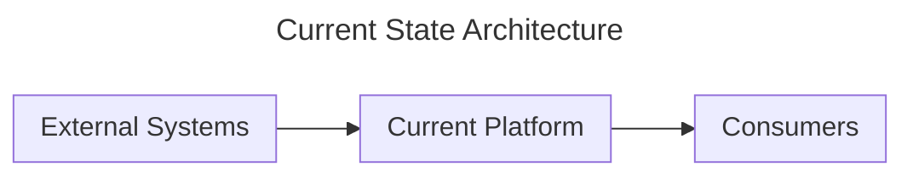
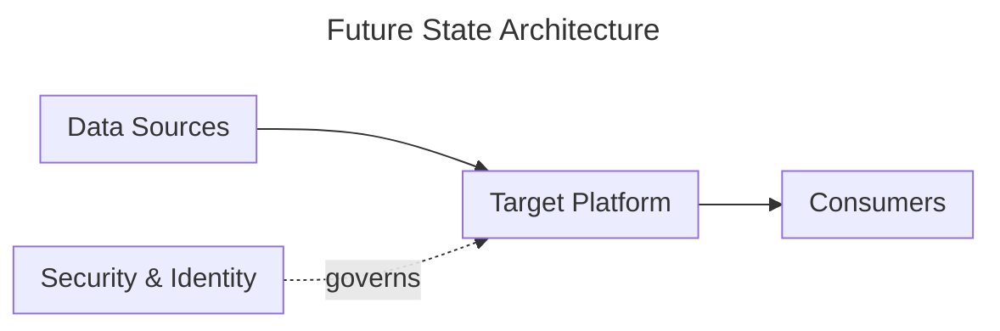

# Architecture Diagramming Skill

This skill provides **diagram generation conventions and patterns** for Architecture Design Sessions. It is domain-agnostic — the domain skill (e.g., Databricks, Fabric, AWS) supplies the domain-specific components, while this skill supplies the diagramming methodology, style guide, and generic architecture patterns.

## Dual-Diagram Workflow

Every ADS session produces **two** architecture diagrams:

### 1. Current State Diagram (after Phase 2 — Current Landscape)

**Purpose**: Capture the existing environment as-is so both parties share a common baseline.

**What to include**:
- All systems, services, and platforms mentioned by the user
- Integrations and data flows between systems
- Pain points annotated as comments or styled nodes
- Team/ownership boundaries (if discussed)

**Template structure**:


**Rules**:
- Label the diagram clearly as "Current State Architecture" in the title.
- Do NOT include future-state components — this is a snapshot of today.
- Present to the user and explicitly ask: "Does this accurately capture your current environment? Anything missing or incorrect?"
- Do NOT proceed to Phase 3 until the user confirms the current state.

### 2. Future State Diagram (Phase 5 — Future State Diagram Generation)

**Purpose**: The recommended target architecture based on all gathered requirements.

**Template structure**:


**Rules**:
- Label the diagram clearly as "Future State Architecture" in the title.
- Every node must trace back to a requirement gathered during the session.
- Include security, governance, and operational components — not just the happy path.
- After presenting, deliver the Architecture Recap (component table) and Known Limitations.

## Architecture Recap (Mandatory after Future State Diagram)

Present a table for every component in the Future State diagram:

| Component | Role in This Architecture | Why This Was Chosen |
|-----------|---------------------------|---------------------|
| _e.g. API Gateway_ | _Routes requests to backend services_ | _Customer needs rate limiting and auth for 3 external partners_ |
| _e.g. Key Vault_ | _Centralized secrets management_ | _Sensible default — secrets should not live in config files_ |

**Rules**:
- **Every node in the diagram must appear in the recap.** Do not skip security, networking, or governance components.
- **The "Why" column must reference specific requirements from the conversation.** Do not use generic justifications like "best practice." Tie each choice to something the user said.
- **Group components by layer**: Ingestion → Processing → Storage → Serving → Security & Governance → Operations.
- **Call out alternatives considered but not chosen** (e.g., "Event-driven over polling because..."). Use your domain skill's trade-off references when available.
- **Flag decision points** where the user should make a final call.
- **Note sensible defaults** included without explicit user request.

## Diagram Style Guide

See [references/mermaid-style-guide.md](references/mermaid-style-guide.md) for the full Mermaid style guide including node shapes, arrow conventions, subgraph naming, and layout direction heuristics.

## Generic Architecture Patterns

See [references/generic-patterns.md](references/generic-patterns.md) for domain-agnostic architecture patterns (hub-spoke, layered, event-driven, microservices, etc.) that can be used as starting points before applying domain-specific components from the domain skill.

## Render to PNG

After generating the Mermaid syntax:

1. Write the Mermaid code to a `.mmd` file in the workspace:
   ```
   diagrams/<name>.mmd
   ```

2. Convert to PNG using mermaid-cli:
   ```bash
   npx -y @mermaid-js/mermaid-cli -i diagrams/<name>.mmd -o diagrams/<name>.png --scale 3 --backgroundColor white --width 1600
   ```

3. Tell the user where the PNG file is:
   > "Architecture diagram saved to `diagrams/<name>.png`. Open the file to view."

If `npx` is unavailable, write the Mermaid to a `.md` file wrapped in a mermaid code fence and instruct the user to open it with VS Code's Markdown preview (Ctrl+Shift+V).

## Reference Files

| File | Purpose |
|------|---------|
| [references/mermaid-style-guide.md](references/mermaid-style-guide.md) | Node shapes, arrow styles, subgraph conventions, layout direction heuristics |
| [references/generic-patterns.md](references/generic-patterns.md) | Domain-agnostic architecture patterns as Mermaid starting points |
