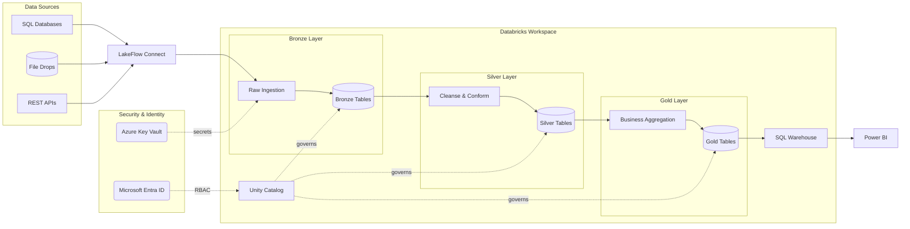
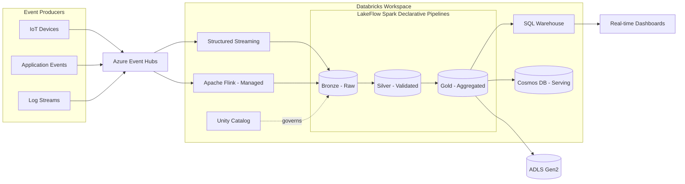
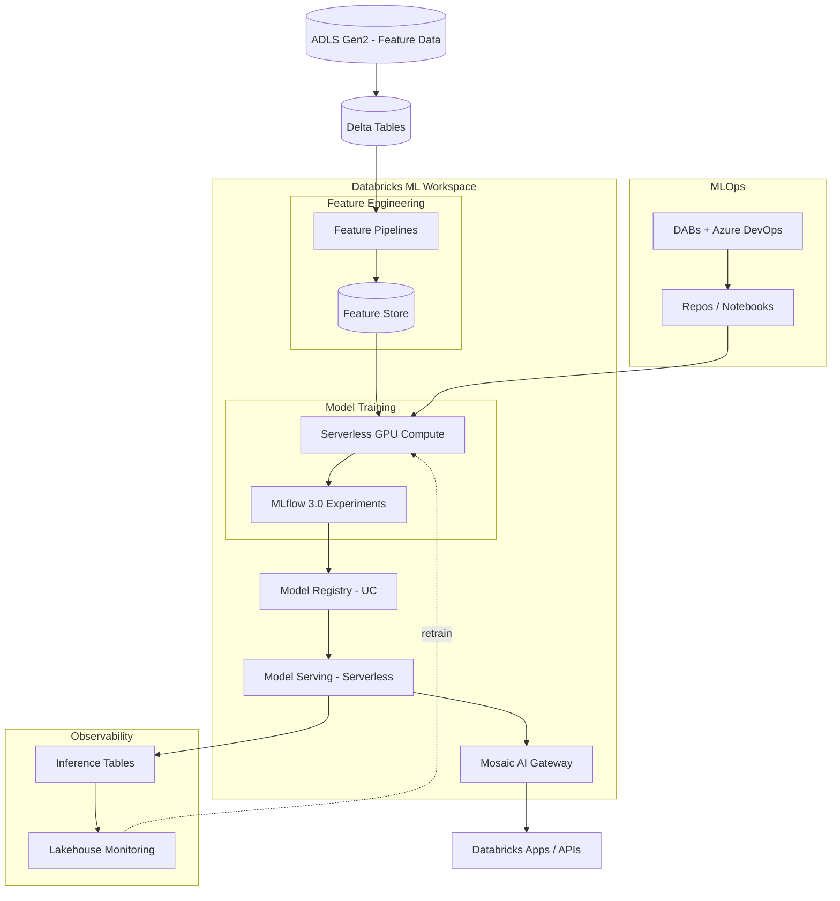
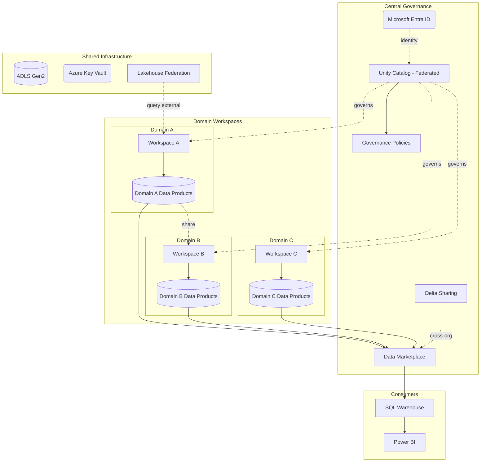
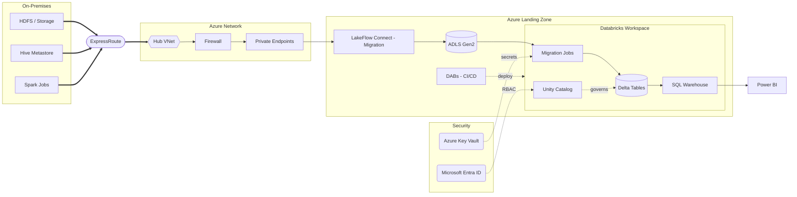
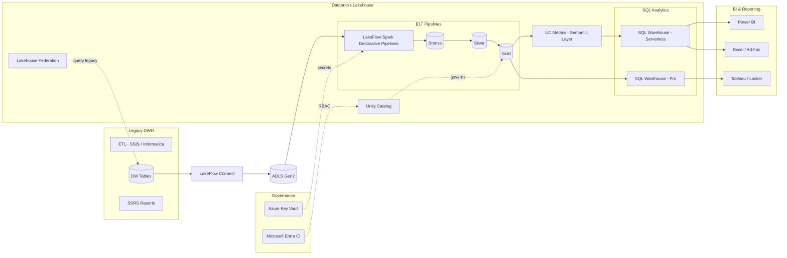
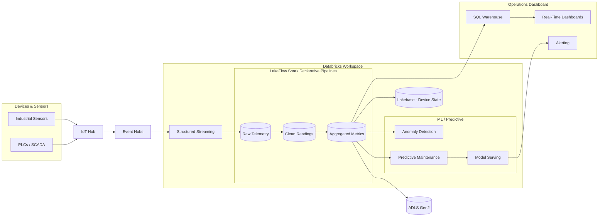
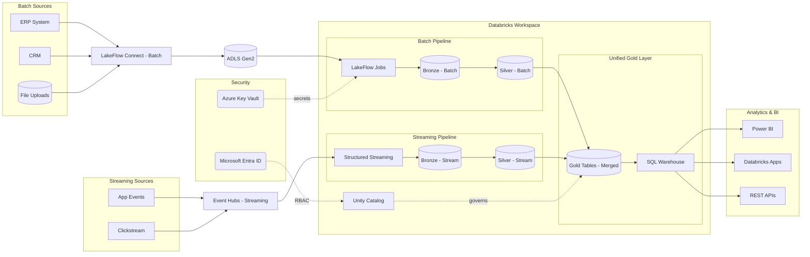
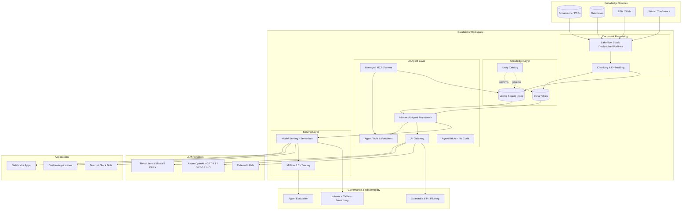

# Databricks Architecture Patterns

## Pattern Selection Decision Tree

```
START
├── Is this a migration from an existing platform?
│   ├── YES → Which source platform?
│   │   ├── Hadoop/Hive → Pattern 5: On-Prem Migration
│   │   ├── Snowflake/Redshift/Synapse/BigQuery → Pattern 6: Data Warehouse Replacement
│   │   ├── AWS EMR/Glue → Pattern 5 (cloud-to-cloud variant)
│   │   └── On-prem SQL Server/Oracle → Pattern 5 (database migration variant)
│   └── NO → Greenfield. What's the primary workload?
│       ├── General analytics / data warehouse → Pattern 1: Medallion Lakehouse
│       ├── Real-time / streaming → Pattern 2: Streaming Lakehouse
│       ├── Classical ML/AI focus → Pattern 3: ML & AI Platform
│       ├── GenAI / AI agents / RAG / chatbots → Pattern 9: GenAI & AI Agent Platform
│       ├── Multi-team / data mesh → Pattern 4: Data Mesh
│       ├── IoT / telemetry → Pattern 7: IoT Analytics
│       └── Mixed batch + streaming → Pattern 8: Hybrid
│
├── Are there real-time requirements?
│   ├── YES → Combine chosen pattern with Pattern 2 (Streaming) components
│   └── NO → Batch-only design
│
├── Are there ML/AI workloads?
│   ├── YES → Add Pattern 3 (ML) components to chosen pattern
│   └── NO → Skip ML infrastructure
│
├── Are there GenAI / AI agent requirements?
│   ├── YES → Add Pattern 9 (GenAI) components to chosen pattern
│   └── NO → Skip AI agent infrastructure
│
└── Multiple teams with domain ownership?
    ├── YES → Overlay Pattern 4 (Data Mesh) workspace structure
    └── NO → Single workspace per environment
```

---

## Pattern 1: Medallion Lakehouse

**Use when**: General analytics, data warehouse modernization, single-team data platform, first Databricks deployment.

**Azure Components**: ADLS Gen2, LakeFlow Connect (or ADF for legacy sources), Databricks (LakeFlow Jobs + SQL Warehouse), Unity Catalog, Key Vault, Monitor, Entra ID

**Architecture**:
```
Sources → LakeFlow Connect (Ingest) → ADLS Gen2 (Bronze) → LakeFlow Jobs (Transform)
→ ADLS Gen2 (Silver) → LakeFlow Jobs (Curate) → ADLS Gen2 (Gold)
→ SQL Warehouse (Serve) → Power BI / Tableau
Unity Catalog governs all layers. Liquid Clustering replaces partitioning + Z-ORDER.
```

**Diagram Code**:


---

## Pattern 2: Streaming Lakehouse

**Use when**: Real-time analytics, sub-minute latency requirements, click-stream, event processing, CDC pipelines.

**Azure Components**: Event Hubs (or IoT Hub), ADLS Gen2, Databricks (Structured Streaming + Apache Flink (managed) + LakeFlow Spark Declarative Pipelines), SQL Warehouse, Key Vault

**Architecture**:
```
Event Producers → Event Hubs → Databricks Structured Streaming → LakeFlow Spark Declarative Pipelines
→ Bronze/Silver/Gold in ADLS Gen2 → SQL Warehouse → Real-time Dashboards
For sub-second latency or complex stateful processing, Apache Flink (managed) provides an alternative to Structured Streaming.
```
**Diagram Code**:


---

## Pattern 3: ML & AI Platform

**Use when**: Machine learning is the primary workload, need MLOps pipeline, model serving, feature engineering, Mosaic AI capabilities.

**Azure Components**: ADLS Gen2, Databricks (ML Runtime + Feature Store + MLflow 3.0 + Mosaic AI), Serverless GPU Compute (managed, auto-scaling A10g/H100), Model Serving (Serverless), Databricks Apps (optional for custom UIs), Key Vault

**Architecture**:
```
Feature Data → Databricks Feature Store → Serverless GPU Compute (managed, auto-scaling)
→ MLflow 3.0 Experiment Tracking → Model Registry → Model Serving Endpoints
→ Mosaic AI Gateway → Databricks Apps / External Applications
```

**Diagram Code**:


---

## Pattern 4: Data Mesh

**Use when**: Multiple teams with domain ownership, organizational decentralization, self-service analytics with governance.

**Azure Components**: Multiple Databricks Workspaces, Unity Catalog (metastore federation), ADLS Gen2 per domain, Entra ID, Azure Policy, Delta Sharing, Lakehouse Federation

**Architecture**:
```
Central Governance (Unity Catalog Metastore + Entra ID + Delta Sharing)
├── Domain A Workspace → Domain A Storage → Domain A Products
├── Domain B Workspace → Domain B Storage → Domain B Products
└── Domain C Workspace → Domain C Storage → Domain C Products
Cross-domain sharing via Unity Catalog data sharing and Delta Sharing (cross-org).
Lakehouse Federation for querying external systems without ETL.
```

**Diagram Code**:


---

## Pattern 5: On-Prem Migration

**Use when**: Migrating from Hadoop, Teradata, Oracle, or on-prem SQL Server. Requires hybrid connectivity.

**Azure Components**: ExpressRoute/VPN Gateway, VNet, ADLS Gen2, LakeFlow Connect (replaces ADF for most sources), Databricks (VNet-injected), Private Endpoints, DABs (CI/CD)

**Architecture**:
```
On-Prem Systems → ExpressRoute/VPN → Azure VNet → LakeFlow Connect (Data Movement)
→ ADLS Gen2 (Landing Zone) → Databricks (VNet-injected, Transform)
→ Delta Lake (Medallion, Liquid Clustering) → SQL Warehouse → BI Tools
Deploy with DABs for repeatable infrastructure-as-code.
```

**Diagram Code**:


---

## Pattern 6: Data Warehouse Replacement

**Use when**: Replacing Snowflake, Synapse dedicated pools, Redshift, BigQuery, or Teradata with Databricks SQL.

**Azure Components**: ADLS Gen2, LakeFlow Connect (or ADF for legacy), LakeFlow Spark Declarative Pipelines, Databricks SQL Warehouse, dbt, Unity Catalog, Unity Catalog Metrics (semantic layer), Lakehouse Federation, Power BI

**Architecture**:
```
Sources → LakeFlow Connect / Auto Loader → ADLS Gen2 → LakeFlow Spark Declarative Pipelines → Medallion layers
→ SQL Warehouse → BI Tools (Power BI / Tableau)
Unity Catalog replaces source system's catalog. dbt replaces stored procedures.
Lakehouse Federation enables querying legacy DWH during migration without ETL.
Liquid Clustering replaces distribution keys and Z-ORDER.
Unity Catalog Metrics defines business KPIs once, usable across SQL Warehouse, AI/BI Genie, and BI tools.
```

**Diagram Code**:


---

## Pattern 7: IoT Analytics

**Use when**: Device telemetry, sensor data, industrial IoT, smart building, fleet management.

**Azure Components**: IoT Hub, Event Hubs, Databricks (Structured Streaming + LakeFlow Spark Declarative Pipelines), ADLS Gen2, Azure Data Explorer (optional for time-series queries), Lakebase (optional for device state serving), Power BI

**Architecture**:
```
IoT Devices → IoT Hub → Event Hubs (routing) → Databricks Structured Streaming
→ Delta Lake (hot/warm/cold tiers) → SQL Warehouse → Operational Dashboards
Optional: Digital Twins for device modeling, ADX for time-series queries,
Lakebase for low-latency device state lookups
```

**Diagram Code**:


---

## Pattern 8: Hybrid Batch + Streaming

**Use when**: Mixed requirements — some data needs real-time processing, other data is batch. Most common in enterprise scenarios.

**Azure Components**: LakeFlow Connect (batch), Event Hubs (streaming), Databricks (LakeFlow Jobs + Structured Streaming), ADLS Gen2, SQL Warehouse, Databricks Apps

**Architecture**:
```
Batch Sources → LakeFlow Connect → ADLS Gen2 (Bronze) → LakeFlow Jobs → Silver/Gold
Streaming Sources → Event Hubs → Databricks Streaming → Bronze → Silver/Gold
Both paths converge in Gold layer → SQL Warehouse → BI Tools / Databricks Apps
```

**Diagram Code**:


---

## Pattern 9: GenAI & AI Agent Platform

**Use when**: Generative AI applications, RAG chatbots, AI agents, document intelligence, LLM-powered workflows, compound AI systems.

**Azure Components**: ADLS Gen2, Databricks (Mosaic AI Agent Framework + AI Gateway + Vector Search + Model Serving), Unity Catalog (for data + model governance), LakeFlow Spark Declarative Pipelines (document processing), Managed MCP Servers (agent-tool connectivity), Agent Bricks (no-code agents: Knowledge Assistant, Supervisor Agent), Databricks Apps (agent UI hosting)

**Architecture**:
```
Data Sources → LakeFlow Spark Declarative Pipelines (Document Processing) → Delta Tables + Vector Index
→ Mosaic AI Agent Framework (Agent Logic) → AI Gateway (LLM Routing + Guardrails)
→ Model Serving Endpoints → Databricks Apps / External Applications
MCP (Model Context Protocol) is the standard protocol for connecting agents to external tools and data sources.
Agent Bricks provides no-code agent creation: Knowledge Assistant for document Q&A, Supervisor Agent for multi-agent orchestration.
Unity Catalog governs data, models, and agent definitions. MLflow 3.0 traces agent execution.
```

**Diagram Code**:


---

## Cross-Cutting Concern: Open Table Formats

All patterns above default to **Delta Lake** as the table format. In multi-engine or multi-cloud environments, address the table format question explicitly:

| Scenario | Recommendation |
|----------|---------------|
| All-in on Databricks | Delta Lake (default). Use UniForm for Iceberg client compatibility. |
| Databricks + Snowflake coexistence | Iceberg managed tables in Unity Catalog. Both engines read natively. |
| Multi-cloud with different query engines | Iceberg for portability. Unity Catalog Iceberg REST API for governance. |
| Avoiding vendor lock-in | Iceberg + Apache Polaris catalog. Databricks reads via Iceberg Catalog Federation. |
| Sharing data with external parties | Delta Sharing (supports both Delta and Iceberg clients as of Dec 2025). |

**Key products**:
- **UniForm**: Zero-copy Delta↔Iceberg interoperability. Delta tables automatically readable as Iceberg by external engines.
- **Iceberg Managed Tables**: Unity Catalog-managed Iceberg tables with Liquid Clustering and Predictive Optimization.
- **Compatibility Mode**: Read-only copy of UC tables auto-synced for external engines (Athena, Snowflake, Fabric) without data copying.
- **Iceberg Catalog Federation**: Govern Iceberg tables in AWS Glue, Hive Metastore, or Snowflake without moving data.

---

## Cross-Cutting Concern: FinOps & Cost Optimization

Every architecture pattern should include cost design as a first-class concern. Address these in every ADS session:

| Design Decision | Cost-Optimized Choice | When to Override |
|----------------|----------------------|-----------------|
| Compute type | Serverless (SQL Warehouse, Jobs) — pay per use | Sustained high-concurrency → Provisioned Pro |
| ML training compute | Serverless GPU Compute — no idle cost | Large-scale distributed training → reserved GPU clusters |
| Batch workloads | Spot instances + auto-termination policies | SLA-critical jobs that cannot tolerate preemption |
| Cluster sizing | Start small, auto-scale up | Known steady-state workloads → right-size from start |
| Storage tiering | Hot (ADLS Gen2) for active, Cool/Archive for historical | All data accessed frequently → keep on Hot |
| SQL Warehouse sizing | Serverless (auto-scales to zero) | Predictable high load → Pro with reserved capacity |

**Key practices**:
- **Tag everything**: Environment, team, cost-center, workload tags on clusters, jobs, and warehouses for chargeback.
- **Unity Catalog lineage for cost attribution**: Trace which teams and data products consume compute.
- **Databricks system tables**: Query `system.billing.usage` for DBU consumption by workspace, cluster, and user.
- **Photon engine**: Enable for SQL-heavy workloads (2-8x faster, fewer DBUs per query). Skip for Python-heavy notebooks.
- **Auto-termination**: Enforce via cluster policies — default 15-30 minutes for interactive, immediate for jobs.

---

## Combining Patterns

Most real-world architectures combine 2-3 patterns. Common combinations:

| Primary Pattern | Add-On | Result |
|----------------|--------|--------|
| Medallion Lakehouse | + ML Platform | Analytics + ML serving |
| Medallion Lakehouse | + GenAI Platform | Analytics + RAG chatbots + AI agents |
| Streaming Lakehouse | + ML Platform | Real-time predictions |
| Streaming Lakehouse | + GenAI Platform | Real-time data + AI-powered alerting |
| Medallion Lakehouse | + Data Mesh | Multi-team governance |
| On-Prem Migration | + Medallion Lakehouse | Migration target architecture |
| IoT Analytics | + ML Platform | Predictive maintenance |
| DW Replacement | + Streaming | Near-real-time dashboards |
| ML Platform | + GenAI Platform | Classical ML + generative AI serving |
| Data Mesh | + GenAI Platform | Domain-specific AI agents with governance |
| Any Pattern | + FinOps Design | Cost-optimized architecture with chargeback |

When combining, use a single diagram with merged subgraphs. Avoid duplicating shared components (ADLS, Unity Catalog, Key Vault, Entra ID).
