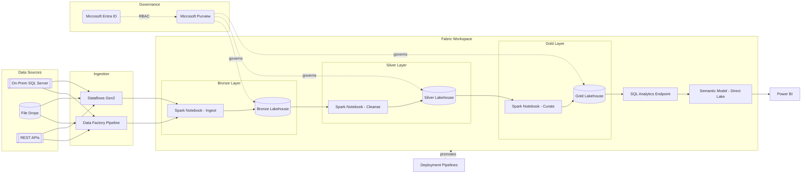
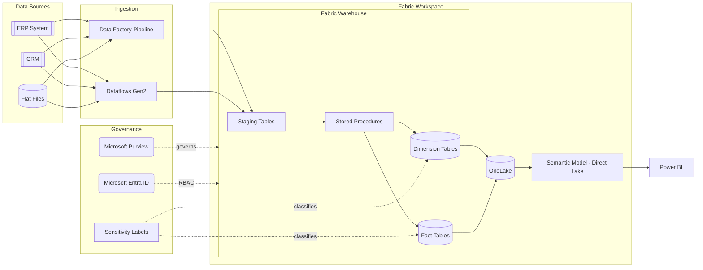
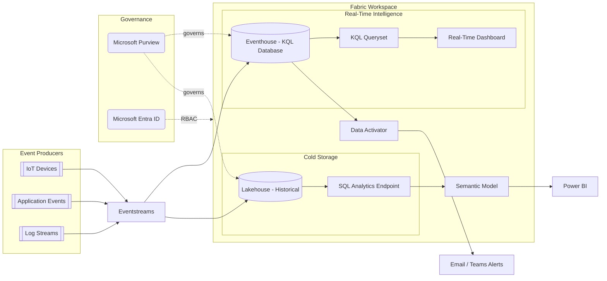
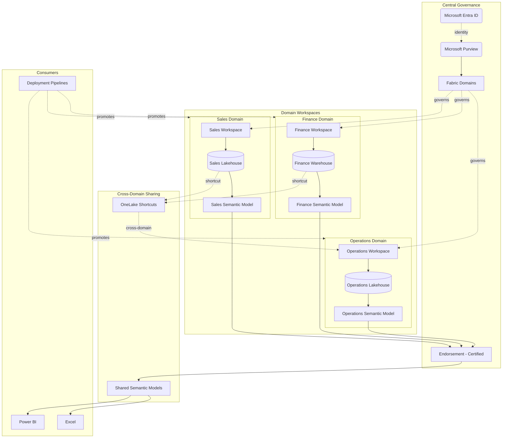
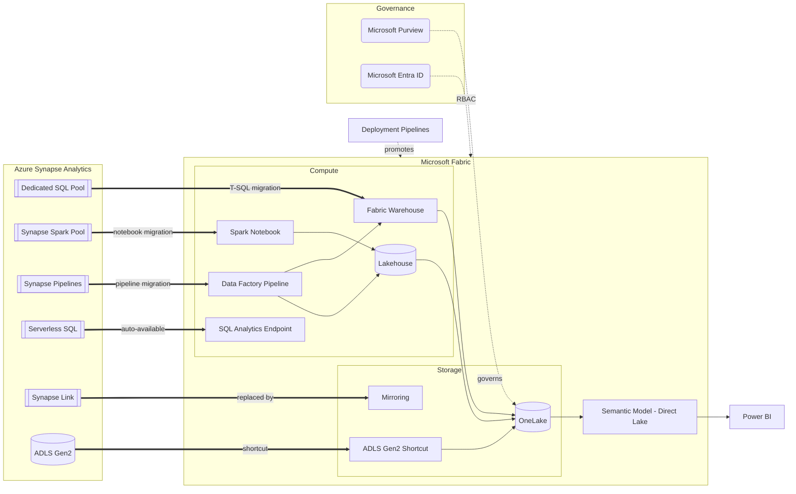
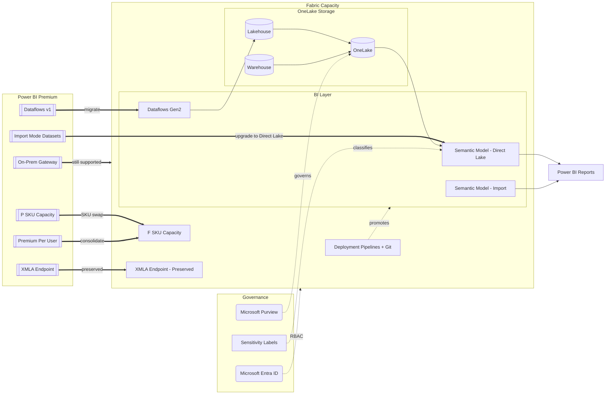
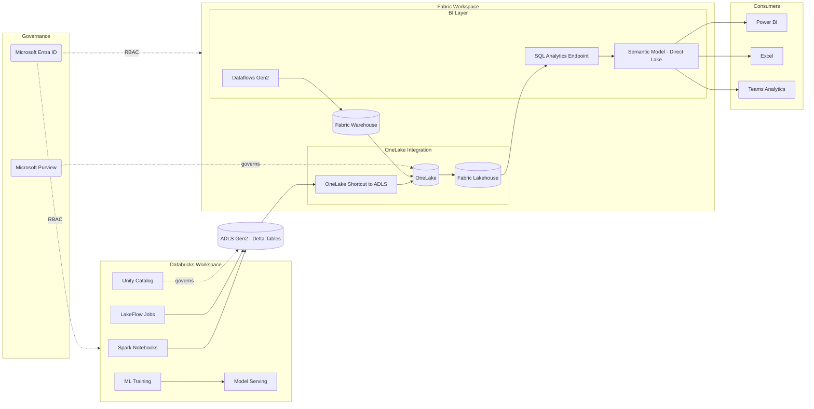
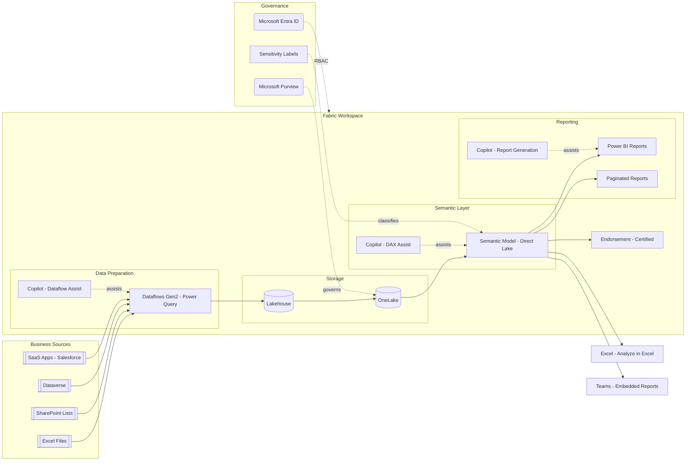

# Microsoft Fabric Architecture Patterns

## Pattern Selection Decision Tree

```
START
├── Is this a migration from an existing platform?
│   ├── YES → Which source platform?
│   │   ├── Azure Synapse Analytics → Pattern 5: Synapse Migration
│   │   ├── Power BI Premium Per Capacity → Pattern 6: Power BI Premium Migration
│   │   ├── Databricks (keeping for ML/engineering) → Pattern 7: Hybrid (Fabric + Databricks)
│   │   └── On-prem SQL Server / Oracle DW → Pattern 5 (via Synapse-style mapping)
│   └── NO → Greenfield. What's the primary workload?
│       ├── General analytics / data warehouse → Pattern 1: Medallion Lakehouse
│       ├── SQL-first / BI-centric analytics → Pattern 2: Enterprise Analytics (Warehouse-First)
│       ├── Real-time / event-driven → Pattern 3: Real-Time Intelligence
│       ├── Multi-team / domain ownership → Pattern 4: Data Mesh
│       ├── Mixed Databricks + BI → Pattern 7: Hybrid (Fabric + Databricks)
│       └── Business user self-service → Pattern 8: Self-Service Analytics
│
├── Are there real-time requirements?
│   ├── YES → Combine chosen pattern with Pattern 3 (Real-Time Intelligence) components
│   └── NO → Batch-only design
│
├── Are there ML/AI workloads?
│   ├── Heavy ML / deep learning → Pattern 7: Hybrid (Fabric + Databricks for ML)
│   ├── Light ML / PREDICT function → Add ML components to chosen pattern
│   └── No ML → Skip ML infrastructure
│
└── Multiple teams with domain ownership?
    ├── YES → Overlay Pattern 4 (Data Mesh) workspace structure
    └── NO → Single workspace per environment
```

---

## Pattern 1: Medallion Lakehouse

**Use when**: General analytics, data lake modernization, unified batch processing, first Microsoft Fabric deployment.

**Fabric Components**: OneLake, Lakehouse, Spark Notebooks, Data Factory Pipelines, Dataflows Gen2, SQL Analytics Endpoint, Semantic Models, Power BI, Microsoft Purview, Deployment Pipelines

**Architecture**:
```
Sources → Data Factory Pipelines / Dataflows Gen2 → Lakehouse (Bronze) → Spark Notebooks (Transform)
→ Lakehouse (Silver) → Spark Notebooks (Curate) → Lakehouse (Gold)
→ SQL Analytics Endpoint → Semantic Model (Direct Lake) → Power BI
All layers stored in OneLake. Purview governs lineage and sensitivity labels.
```

**Diagram Code**:


| Component | Fabric Service | Role |
|-----------|---------------|------|
| Unified storage | OneLake | Single data lake backing all Lakehouses |
| Raw landing | Bronze Lakehouse | Raw ingested data in Delta format |
| Cleansed data | Silver Lakehouse | Validated, conformed, deduplicated data |
| Business-ready | Gold Lakehouse | Aggregated, business-modeled data |
| Ingestion | Data Factory Pipelines | Orchestrated batch data movement |
| Low-code ingest | Dataflows Gen2 | Power Query-based transformation |
| Transform | Spark Notebooks | PySpark / Spark SQL transformations |
| Query endpoint | SQL Analytics Endpoint | T-SQL read-only access to Lakehouse tables |
| Semantic layer | Semantic Model (Direct Lake) | DAX measures + relationships over Gold tables |
| Reporting | Power BI | Dashboards and reports |
| Lifecycle | Deployment Pipelines | Dev → Test → Prod promotion |
| Governance | Microsoft Purview | Lineage, sensitivity labels, data catalog |

**When to Use**:
- First Fabric deployment — start here and extend later
- Batch analytics with structured and semi-structured sources
- Teams already familiar with Spark and Delta Lake concepts
- Need full medallion architecture with clear data quality layers

**When NOT to Use**:
- Pure SQL / BI workload with no Spark need → Pattern 2 (Warehouse-First)
- Sub-second latency streaming → Pattern 3 (Real-Time Intelligence)
- Business users doing self-service without engineering support → Pattern 8

---

## Pattern 2: Enterprise Analytics (Warehouse-First)

**Use when**: SQL-centric analytics, BI-heavy workloads, teams with strong T-SQL skills, Direct Lake performance optimization.

**Fabric Components**: Fabric Warehouse, Data Factory Pipelines, Dataflows Gen2, Stored Procedures, Semantic Models (Direct Lake), Power BI, OneLake, Microsoft Purview, Deployment Pipelines

**Architecture**:
```
Sources → Data Factory Pipelines / Dataflows Gen2 → Fabric Warehouse (Staging → Star Schema)
→ Semantic Model (Direct Lake) → Power BI Reports
Fabric Warehouse uses T-SQL natively. Direct Lake mode eliminates import/refresh for BI.
```

**Diagram Code**:


| Component | Fabric Service | Role |
|-----------|---------------|------|
| Unified storage | OneLake | Parquet/Delta files backing Warehouse tables |
| Data warehouse | Fabric Warehouse | Full T-SQL DDL/DML, star schema modeling |
| Staging | Staging Tables | Landing zone within Warehouse |
| Transform | Stored Procedures | T-SQL transformation logic |
| Ingestion | Data Factory Pipelines | Orchestrated batch loads |
| Low-code ingest | Dataflows Gen2 | Power Query ETL for business sources |
| Semantic layer | Semantic Model (Direct Lake) | Zero-copy BI over Warehouse tables |
| Reporting | Power BI | Reports, dashboards, paginated reports |
| Classification | Sensitivity Labels | Data classification and protection |
| Governance | Microsoft Purview | Catalog, lineage, access policies |

**When to Use**:
- Teams with strong T-SQL / data warehouse skills
- BI-centric workloads where Power BI is the primary consumer
- Star schema modeling with dimensional design
- Need fastest Power BI performance via Direct Lake (no import refresh)
- Replacing Azure SQL DW / Synapse dedicated pools

**When NOT to Use**:
- Heavy Spark / Python-based transformations → Pattern 1 (Medallion Lakehouse)
- Complex streaming requirements → Pattern 3 (Real-Time Intelligence)
- Multi-engine environments needing Spark + SQL → Pattern 1 or Pattern 7

---

## Pattern 3: Real-Time Intelligence

**Use when**: Event-driven analytics, real-time dashboards, anomaly detection, alerting on live data streams.

**Fabric Components**: Eventstreams, Eventhouse (KQL Database), KQL Querysets, Real-Time Dashboards, Data Activator, OneLake, Lakehouse (optional cold store), Microsoft Purview

**Architecture**:
```
Event Producers → Eventstreams → Eventhouse (KQL Database) → KQL Querysets
→ Real-Time Dashboards (live queries)
→ Data Activator (alerts & triggers)
Optional: Eventstreams → Lakehouse for long-term batch analytics on the same data.
```

**Diagram Code**:


| Component | Fabric Service | Role |
|-----------|---------------|------|
| Stream ingestion | Eventstreams | Managed event routing (Kafka-compatible) |
| Hot storage | Eventhouse (KQL Database) | Time-series optimized, sub-second query latency |
| Query language | KQL Querysets | Kusto Query Language for real-time analysis |
| Live dashboards | Real-Time Dashboards | Auto-refreshing visualizations over KQL |
| Alerting | Data Activator | Trigger-based alerts on streaming conditions |
| Cold storage | Lakehouse | Long-term historical storage in Delta format |
| Query bridge | SQL Analytics Endpoint | T-SQL access to historical Lakehouse data |
| Reporting | Power BI | Historical trend reports over cold data |
| Governance | Microsoft Purview | Data catalog, lineage, sensitivity labels |

**When to Use**:
- Sub-second query latency on streaming data
- IoT telemetry, application monitoring, clickstream analytics
- Need built-in alerting on data conditions (Data Activator)
- Time-series data with high ingestion rates
- Real-time dashboards that auto-refresh without scheduled imports

**When NOT to Use**:
- Batch-only analytics with no real-time need → Pattern 1 or Pattern 2
- Complex stateful stream processing (Flink-level) → Consider Databricks Structured Streaming (Pattern 7)
- Primary workload is ML model training → Pattern 7 (Hybrid)

---

## Pattern 4: Data Mesh

**Use when**: Multiple teams with domain ownership, organizational decentralization, self-service analytics with centralized governance.

**Fabric Components**: Multiple Fabric Workspaces (per domain), OneLake, Cross-Workspace Sharing, Endorsement (Certified / Promoted), Microsoft Purview, Domains, Deployment Pipelines, Semantic Models, Power BI

**Architecture**:
```
Central Governance (Microsoft Purview + Entra ID + Domains + Endorsement)
├── Domain A Workspace → Domain A Lakehouse → Domain A Semantic Model (Certified)
├── Domain B Workspace → Domain B Warehouse → Domain B Semantic Model (Certified)
└── Domain C Workspace → Domain C Lakehouse → Domain C Semantic Model (Certified)
Cross-domain data access via OneLake Shortcuts. Endorsement flags trusted data products.
```

**Diagram Code**:


| Component | Fabric Service | Role |
|-----------|---------------|------|
| Domain isolation | Fabric Workspaces | One workspace per domain team |
| Unified storage | OneLake | All domains share one data lake (logically separated) |
| Cross-domain access | OneLake Shortcuts | Zero-copy references to data in other workspaces |
| Data products | Semantic Models | Domain-published, certified analytical models |
| Quality signal | Endorsement (Certified / Promoted) | Trust indicators on data products |
| Organizational grouping | Fabric Domains | Logical grouping of workspaces by business area |
| Governance | Microsoft Purview | Central lineage, catalog, sensitivity labels |
| Identity | Microsoft Entra ID | RBAC, workspace access control |
| Lifecycle | Deployment Pipelines | Per-domain dev → test → prod promotion |
| Reporting | Power BI | Self-service consumption of certified models |

**When to Use**:
- Multiple teams (3+) each owning distinct data domains
- Need decentralized ownership with centralized governance
- Data products must be discoverable and trusted (Endorsement)
- Cross-domain analytics without data duplication (OneLake Shortcuts)
- Organization already using Fabric Domains for workspace grouping

**When NOT to Use**:
- Single team with one data domain → Pattern 1 or Pattern 2
- No governance maturity — mesh requires strong data ownership culture
- Small data estate where workspace separation adds overhead

---

## Pattern 5: Synapse Migration

**Use when**: Migrating from Azure Synapse Analytics (dedicated SQL pools, Synapse Spark, Synapse Pipelines) to Microsoft Fabric.

**Fabric Components**: Fabric Warehouse (replaces dedicated SQL pools), Lakehouse + Spark Notebooks (replaces Synapse Spark), Data Factory Pipelines (replaces Synapse Pipelines), Semantic Models, Power BI, OneLake, Microsoft Purview

**Architecture**:
```
Synapse Dedicated SQL Pools ==> Fabric Warehouse (T-SQL compatible)
Synapse Spark Pools ==> Fabric Lakehouse + Spark Notebooks
Synapse Pipelines ==> Fabric Data Factory Pipelines (near-identical UI)
Synapse Serverless SQL ==> Fabric SQL Analytics Endpoint (auto on every Lakehouse)
Synapse Link ==> Fabric Mirroring (for Cosmos DB, Azure SQL)
ADLS Gen2 storage ==> OneLake (with ADLS Gen2 shortcuts for existing data)
```

**Diagram Code**:


| Component | Synapse (Source) | Fabric (Target) | Migration Notes |
|-----------|-----------------|-----------------|-----------------|
| SQL analytics | Dedicated SQL Pool | Fabric Warehouse | T-SQL largely compatible; replace DISTRIBUTION with default |
| Spark processing | Synapse Spark Pool | Lakehouse + Spark Notebooks | Notebooks portable; remove pool config |
| Orchestration | Synapse Pipelines | Data Factory Pipelines | Near-identical UI; export/import JSON definitions |
| Ad-hoc SQL | Serverless SQL Pool | SQL Analytics Endpoint | Auto-created per Lakehouse; no migration needed |
| Change data capture | Synapse Link | Mirroring | Cosmos DB, Azure SQL DB mirroring built-in |
| Storage | ADLS Gen2 | OneLake + ADLS Shortcuts | Keep ADLS in place; use shortcuts for zero-copy access |
| Governance | Synapse RBAC | Purview + Entra ID | Migrate workspace roles to Fabric workspace roles |
| BI semantic layer | N/A (or AAS) | Semantic Model (Direct Lake) | Upgrade from import mode to Direct Lake |

**When to Use**:
- Existing Synapse Analytics deployment being consolidated into Fabric
- Want unified billing (F SKU capacity) instead of separate Synapse resources
- Synapse Pipelines already in use — near-identical migration
- Need to preserve ADLS Gen2 data in place via Shortcuts

**When NOT to Use**:
- Synapse workloads are stable and cost-effective — migration has no business driver
- Heavy Synapse Spark workloads that need cluster-level control → Pattern 7 (Hybrid with Databricks)
- Real-time streaming was primary Synapse use → Pattern 3 (Real-Time Intelligence)

---

## Pattern 6: Power BI Premium Migration

**Use when**: Migrating from Power BI Premium Per Capacity (P SKUs) to Fabric F SKU capacity with Direct Lake upgrade.

**Fabric Components**: Fabric Capacity (F SKUs), Semantic Models (Direct Lake), Lakehouse or Warehouse, Power BI, Deployment Pipelines, OneLake, Microsoft Purview

**Architecture**:
```
Power BI Premium (P SKU) ==> Fabric Capacity (F SKU)
Import Mode Datasets ==> Direct Lake Semantic Models (zero-copy from OneLake)
Premium Per User ==> Fabric F64+ (or F SKU + Pro licenses for viewers)
Dataflows ==> Dataflows Gen2 (output to Lakehouse, not just Power BI storage)
XMLA Endpoints ==> Preserved in Fabric (same XMLA connectivity)
Deployment Pipelines ==> Preserved (enhanced with Git integration)
```

**Diagram Code**:


| Component | PBI Premium (Source) | Fabric (Target) | Migration Notes |
|-----------|---------------------|-----------------|-----------------|
| Capacity | P1/P2/P3/P4/P5 SKU | F64/F128/F256/F512/F1024 SKU | F SKUs offer pause/resume; map P1→F64, P2→F128, etc. |
| Datasets | Import Mode Datasets | Semantic Models (Direct Lake) | Requires data in OneLake; eliminates scheduled refresh |
| Dataflows | Dataflows v1 | Dataflows Gen2 | Gen2 outputs to Lakehouse (not just PBI storage) |
| Per-user | Premium Per User | F64+ Capacity (shared) | Consolidate PPU users under capacity |
| XMLA | XMLA Read/Write | XMLA Read/Write (preserved) | No change needed; same connectivity |
| Gateways | On-Premises Gateway | On-Premises Gateway (preserved) | Still required for on-prem sources |
| Deployment | Deployment Pipelines | Deployment Pipelines + Git | Enhanced with native Git integration |
| Governance | Workspace-level | Purview + Sensitivity Labels | Upgrade to enterprise-grade governance |

**When to Use**:
- Power BI Premium capacity being consolidated into Fabric
- Want to leverage Direct Lake for zero-copy BI (eliminate import refresh)
- Dataflows v1 outputs need to land in a Lakehouse (not just PBI storage)
- Need Fabric compute (Spark, Warehouse) alongside existing BI
- Premium Per User is becoming cost-prohibitive at scale

**When NOT to Use**:
- Small team on Power BI Pro — no need for capacity-based licensing
- All datasets must remain Import Mode (complex DAX incompatible with Direct Lake)
- No Fabric compute workloads planned — stay on P SKU if only BI is needed

---

## Pattern 7: Hybrid (Fabric + Databricks)

**Use when**: Databricks handles heavy data engineering, ML training, and advanced analytics; Fabric handles BI, self-service analytics, and the semantic layer. Connected via OneLake Shortcuts.

**Fabric Components**: OneLake, OneLake Shortcuts (to ADLS Gen2 / Databricks-managed storage), Lakehouse, Semantic Models (Direct Lake), Power BI, Fabric Warehouse (optional), Microsoft Purview

**Architecture**:
```
Data Engineering (Databricks) → ADLS Gen2 (Delta Tables) → OneLake Shortcuts (zero-copy)
→ Fabric Lakehouse → SQL Analytics Endpoint → Semantic Model (Direct Lake) → Power BI
Databricks owns: ingestion, heavy transforms, ML training, model serving.
Fabric owns: BI semantic layer, self-service analytics, governed data products, report delivery.
```

**Diagram Code**:


| Component | Platform | Role |
|-----------|----------|------|
| Data engineering | Databricks | Heavy Spark transforms, complex ETL |
| ML training | Databricks | GPU training, experiment tracking, model registry |
| Model serving | Databricks | Real-time and batch inference endpoints |
| Data catalog (engineering) | Databricks Unity Catalog | Governance over engineering tables |
| Shared storage | ADLS Gen2 | Delta tables accessible by both platforms |
| Zero-copy access | OneLake Shortcuts | Fabric reads Databricks Delta tables without copying |
| Lakehouse | Fabric Lakehouse | Read-only view of shortcutted data + Fabric-native tables |
| SQL access | SQL Analytics Endpoint | T-SQL access for BI tools and ad-hoc queries |
| Semantic layer | Semantic Model (Direct Lake) | DAX measures and relationships for Power BI |
| Self-service | Dataflows Gen2 | Business user data prep landing in Fabric Warehouse |
| Governance (BI) | Microsoft Purview | Lineage, sensitivity labels for BI layer |
| Reporting | Power BI | Dashboards, reports, embedded analytics |

**When to Use**:
- Existing Databricks investment for data engineering and ML
- Power BI is the primary BI tool and needs Direct Lake performance
- Want Fabric's self-service capabilities without migrating engineering pipelines
- Organization has both platform engineering and BI teams with different skill sets
- Need OneLake as a unified semantic layer over Databricks-managed data

**When NOT to Use**:
- No Databricks investment — use Pattern 1 or Pattern 2 instead
- Databricks SQL Warehouses already serve BI needs — adding Fabric adds complexity
- Small data estate where one platform suffices

---

## Pattern 8: Self-Service Analytics

**Use when**: Business users need to prepare data, build reports, and explore insights without engineering support. Copilot-assisted.

**Fabric Components**: Dataflows Gen2, Lakehouse, Semantic Models, Power BI, Copilot in Fabric, Excel, OneLake, Endorsement, Microsoft Purview

**Architecture**:
```
Business User Sources (Excel, SharePoint, Dataverse) → Dataflows Gen2 (Power Query)
→ Lakehouse → Semantic Model (Direct Lake) → Power BI (with Copilot)
Governed by Endorsement (Certified data products). Copilot assists with DAX, KQL, and report generation.
```

**Diagram Code**:


| Component | Fabric Service | Role |
|-----------|---------------|------|
| Data prep | Dataflows Gen2 | Power Query-based no-code/low-code ETL |
| AI assist (prep) | Copilot in Dataflows | Natural language to Power Query M transforms |
| Storage | Lakehouse | Structured output from Dataflows in Delta format |
| Unified storage | OneLake | Backing store for all Fabric items |
| Semantic layer | Semantic Model (Direct Lake) | Business measures, relationships, hierarchies |
| AI assist (model) | Copilot in Semantic Models | DAX formula generation and explanation |
| Reporting | Power BI | Interactive dashboards and reports |
| AI assist (reports) | Copilot in Power BI | Automatic report page generation, Q&A |
| Operational reports | Paginated Reports | Pixel-perfect, printable report delivery |
| Trust signal | Endorsement (Certified) | Marks data products as vetted and trusted |
| Consumption | Excel (Analyze in Excel) | Pivot tables connected to Semantic Models |
| Consumption | Teams (Embedded) | Reports embedded in Teams channels |
| Governance | Microsoft Purview | Data catalog, lineage, sensitivity labels |

**When to Use**:
- Business analysts and power users are primary data consumers
- Low engineering resources — need low-code/no-code tooling
- Power Query skills already exist in the organization
- Copilot adoption is a strategic priority
- Need governed self-service with Endorsement and sensitivity labels

**When NOT to Use**:
- Complex transformations requiring Spark → Pattern 1 (Medallion Lakehouse)
- High-volume engineering pipelines → Pattern 1 or Pattern 7
- Real-time streaming → Pattern 3 (Real-Time Intelligence)
- Team prefers SQL over Power Query → Pattern 2 (Warehouse-First)

---

## Cross-Cutting Concern: Capacity Planning (F SKUs)

All patterns above run on **Fabric Capacity Units (CUs)**. Unlike Databricks (per-cluster DBUs), Fabric shares a single CU pool across all workloads. Address capacity planning in every ADS session:

| F SKU | CUs | Typical Workload | Max Spark vCores | Direct Lake Rows Limit |
|-------|-----|-------------------|-------------------|----------------------|
| F2 | 2 | Dev/test, PoC | 4 | 300M |
| F4 | 4 | Small team dev | 8 | 300M |
| F8 | 8 | Department BI | 16 | 300M |
| F16 | 16 | Team analytics | 32 | 300M |
| F32 | 32 | Multi-team | 64 | 600M |
| F64 | 64 | Enterprise BI | 128 | 1.5B |
| F128 | 128 | Large enterprise | 256 | 3B |
| F256 | 256 | Heavy Spark + BI | 512 | 6B |
| F512 | 512 | Enterprise scale | 1024 | 12B |
| F1024 | 1024 | Maximum scale | 2048 | 24B |

**Key practices**:
- **Capacity smoothing**: Fabric auto-distributes CUs across workloads. No cluster sizing needed.
- **Pause/resume**: F SKUs support pause — stop paying when idle (P SKUs cannot pause).
- **Burst**: Short workload spikes can borrow from future capacity (smoothing window).
- **Capacity Metrics App**: Monitor CU utilization per workload type (Spark, Warehouse, Dataflows, Semantic Models).
- **Multi-capacity strategy**: Separate dev (F8) from prod (F64+). Use Deployment Pipelines to promote across.
- **Cost allocation**: Fabric Domains + workspace-level CU reporting for team chargeback.

---

## Cross-Cutting Concern: Governance and Security

Every pattern should include governance as a first-class concern:

| Design Decision | Recommended Choice | When to Override |
|----------------|-------------------|------------------|
| Data catalog | Microsoft Purview | Small team with no compliance needs → workspace-level governance |
| Access control | Entra ID + Workspace Roles | Fine-grained row/column security → use Semantic Model RLS/OLS |
| Data classification | Sensitivity Labels | No regulatory requirements → skip initial deployment |
| Trust indicators | Endorsement (Certified / Promoted) | Single team → informal trust model |
| Lineage tracking | Purview Lineage (auto-captured) | Always enable — no cost for Fabric native lineage |
| Cross-workspace access | OneLake Shortcuts | Data must be physically copied → pipeline-based replication |
| Lifecycle promotion | Deployment Pipelines + Git | Small PoC → manual promotion acceptable |

**Key practices**:
- **Workspace-as-security-boundary**: Each workspace is a permission boundary. Use one workspace per team per environment.
- **Sensitivity Labels flow downstream**: Labels on Lakehouse tables propagate to Semantic Models and Power BI reports.
- **Endorsement as data product quality**: Only `Certified` items should be used for executive reporting.
- **Private Links**: For regulated industries, configure Fabric Private Links to restrict traffic to private network.
- **Managed Private Endpoints**: Fabric Spark can connect to Azure PaaS services via managed private endpoints.

---

## Combining Patterns

Most real-world architectures combine 2-3 patterns. Common combinations:

| Primary Pattern | Add-On | Result |
|----------------|--------|--------|
| Medallion Lakehouse | + Real-Time Intelligence | Batch + streaming unified in OneLake |
| Medallion Lakehouse | + Data Mesh | Multi-team governance over Lakehouse layers |
| Enterprise Analytics | + Self-Service | Warehouse for governed data + self-service for business users |
| Enterprise Analytics | + Real-Time Intelligence | SQL analytics + real-time dashboards |
| Synapse Migration | + Medallion Lakehouse | Migration target architecture in Fabric |
| Synapse Migration | + Enterprise Analytics | Direct DW migration path |
| PBI Premium Migration | + Self-Service | Upgraded capacity + Copilot-assisted analytics |
| PBI Premium Migration | + Medallion Lakehouse | BI + full data engineering in one capacity |
| Hybrid (Fabric + DBX) | + Data Mesh | Databricks engineering + Fabric BI per domain |
| Hybrid (Fabric + DBX) | + Self-Service | Engineering in DBX + business self-service in Fabric |
| Any Pattern | + Governance and Security | Enterprise-grade compliance and data protection |

When combining, use a single diagram with merged subgraphs. Avoid duplicating shared components (OneLake, Purview, Entra ID, Deployment Pipelines).
